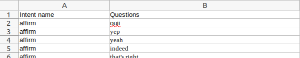

## noise test generator 

## package required : pandas 

### Put a csv file in the input folder 

### Important: The input file should have the same columns name like this pic: **Intent name - Questions**

### Run the script :
**python main.app**

### Result in the output folder

